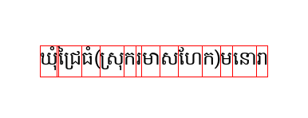

# kh_tex_sep
khmer text clusters with *correct* bbox 


tldr ^^^


usage example:

```python
from kh_bbox_gen import KhmerTextClusterGenerator
renderer = KhmerTextRenderer(font_path="./Hanuman-Regular.ttf", font_size=24)
test_text = "សានកែវមនោរា"
clusters = renderer.render_text(test_text, "khmer_text_with_boxes.png")
```
